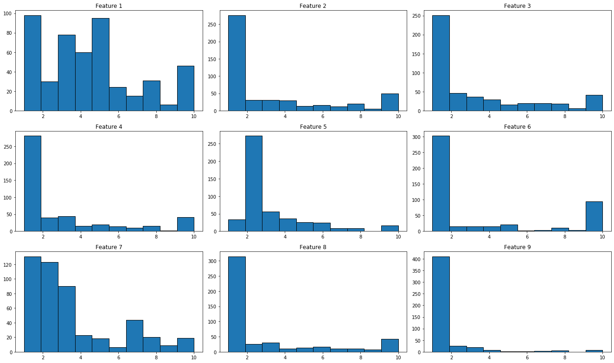
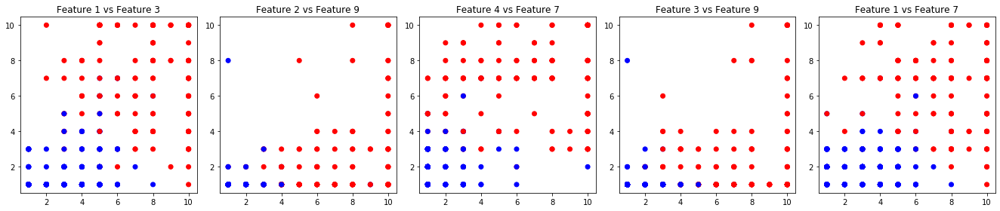
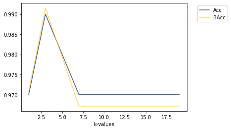
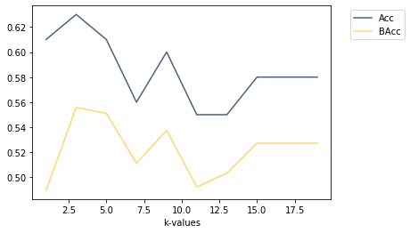

## Question 1 (3 points) 
### Machine learning definitions: 
Our purpose is to create a coin classification system for a vending machine. What types of Machine Learning, if any, best describe the following scenarios? Please provide a brief explanation. 

**(1 point) (i)** The exact specifications of each coin are measured by an engineer. The vending machine recognizes a given coin based on these specifications. 

*This can not be described as a type of machine learning because the machine isn’t learning from the data, it is just going through an algorithm to determine which coin is which.*

**(1 point) (ii)** An algorithm is presented with a large set of labeled coins and uses this data to infer decision boundaries, based on which the vending machine classifies new coins. 

*This can be described as a supervised/predictive learning because there is training data with labels that the machine learns from in order to classify new coins.*

**(1 point) (iii)** An algorithm is successively presented with coins. Each time the algorithm makes a decision about the coin type and checks the correctness of the decision with the engineer. Based on the engineer’s answer, the algorithm refines the process with which it makes the decision for the next coin.

*This can be described as reinforcement learning because there are no predetermined labels, the machine learns the optimal classification based on the feedback it receives from the engineer.*

## Question 2 (7 points)

### Classifying benign vs malignant tumors: 
We would like to classify if a tumor is benign
or malign based on its attributes. We use data from the following UCI Machine Learning Repository: https://archive.ics.uci.edu/ml/datasets/breast+cancer+wisconsin+(original).
Inside “Homework 1” folder on Piazza you can find three files including the train and test data
(named “hw1 question1 train.csv”, “hw1 question1 dev.csv”, and ”hw1 question1 test.csv”)
for our experiments. The rows of these files refer to the data samples, while the columns denote
the features (columns 1-9) and the class variable (column 10), as described bellow:

1. Clump Thickness: discrete values {1, 10}
2. Uniformity of Cell Size: discrete values {1, 10}
3. Uniformity of Cell Shape: discrete values {1, 10}
4. Marginal Adhesion: discrete values {1, 10}
5. Single Epithelial Cell Size: discrete values {1, 10}

6. Bare Nuclei: discrete values {1, 10}
7. Bland Chromatin: discrete values {1, 10}
8. Normal Nucleoli: discrete values {1, 10}
9. Mitoses: discrete values {1, 10}
10. Class: 2 for benign, 4 for malignant (this is the outcome)


```python
from datascience import *
import numpy as np
from pandas import *
from math import *

%matplotlib inline
import matplotlib.pyplot as plt
from operator import itemgetter
```

**(a.i) (1 point) Data exploration:** Using the training data, compute the number of samples
belonging to the benign and the number of samples belonging to the malignant case. What do
you observe? Are the two classes equally distributed in the data?


```python
# import data from .csv file into table
training_data = Table.read_table('hw1_question1_train.csv')
training_data
```


<table border="1" class="dataframe">
    <thead>
        <tr>
            <th>f1</th> <th>f2</th> <th>f3</th> <th>f4</th> <th>f5</th> <th>f6</th> <th>f7</th> <th>f8</th> <th>f9</th> <th>label</th>
        </tr>
    </thead>
    <tbody>
        <tr>
            <td>10  </td> <td>10  </td> <td>9   </td> <td>3   </td> <td>7   </td> <td>5   </td> <td>3   </td> <td>5   </td> <td>1   </td> <td>4    </td>
        </tr>
        <tr>
            <td>1   </td> <td>1   </td> <td>1   </td> <td>1   </td> <td>1   </td> <td>1   </td> <td>3   </td> <td>1   </td> <td>1   </td> <td>2    </td>
        </tr>
        <tr>
            <td>1   </td> <td>1   </td> <td>1   </td> <td>1   </td> <td>1   </td> <td>1   </td> <td>3   </td> <td>1   </td> <td>1   </td> <td>2    </td>
        </tr>
        <tr>
            <td>5   </td> <td>1   </td> <td>1   </td> <td>1   </td> <td>1   </td> <td>1   </td> <td>3   </td> <td>1   </td> <td>1   </td> <td>2    </td>
        </tr>
        <tr>
            <td>8   </td> <td>10  </td> <td>10  </td> <td>10  </td> <td>5   </td> <td>10  </td> <td>8   </td> <td>10  </td> <td>6   </td> <td>4    </td>
        </tr>
        <tr>
            <td>8   </td> <td>10  </td> <td>8   </td> <td>8   </td> <td>4   </td> <td>8   </td> <td>7   </td> <td>7   </td> <td>1   </td> <td>4    </td>
        </tr>
        <tr>
            <td>1   </td> <td>1   </td> <td>1   </td> <td>1   </td> <td>2   </td> <td>1   </td> <td>3   </td> <td>1   </td> <td>1   </td> <td>2    </td>
        </tr>
        <tr>
            <td>10  </td> <td>10  </td> <td>10  </td> <td>10  </td> <td>7   </td> <td>10  </td> <td>7   </td> <td>10  </td> <td>4   </td> <td>4    </td>
        </tr>
        <tr>
            <td>10  </td> <td>10  </td> <td>10  </td> <td>10  </td> <td>3   </td> <td>10  </td> <td>10  </td> <td>6   </td> <td>1   </td> <td>4    </td>
        </tr>
        <tr>
            <td>8   </td> <td>7   </td> <td>8   </td> <td>7   </td> <td>5   </td> <td>5   </td> <td>5   </td> <td>10  </td> <td>2   </td> <td>4    </td>
        </tr>
    </tbody>
</table>
<p>... (473 rows omitted)</p>


```python
# count the total number of samples in the benign/malignant class 
num_benign = training_data.where('label', are.equal_to(2)).num_rows
num_malignant = training_data.where('label', are.equal_to(4)).num_rows

print('Number of samples belonging to benign class:', num_benign) 
print('Number of samples belonging to malignant class:', num_malignant) 
```

    Number of samples belonging to benign class: 330
    Number of samples belonging to malignant class: 153
    

*The two classes are not evenly distributed in the data, there are 330 samples that belong to the benign class while only 153 belong to the malignant class.*

**(a.ii) (1 point) Data exploration:** Using the training data, plot the histogram of each feature
(i.e., 9 total histograms). How are the features distributed in the 1-10 range? Are the sample
values distributed equally for each feature?


```python
fig, ax = plt.subplots(3,3)
fig.set_size_inches(18.5, 11, forward=True)

f1 = training_data.column('f1')
ax[0][0].hist(f1)
ax[0][0].set_title('Feature 1')

f2 = training_data.column('f2')
ax[0][1].hist(f2)
ax[0][1].set_title('Feature 2')

f3 = training_data.column('f3')
ax[0][2].hist(f3)
ax[0][2].set_title('Feature 3')

f4 = training_data.column('f4')
ax[1][0].hist(f4)
ax[1][0].set_title('Feature 4')

f5 = training_data.column('f5')
ax[1][1].hist(f5)
ax[1][1].set_title('Feature 5')

f6 = training_data.column('f6')
ax[1][2].hist(f6)
ax[1][2].set_title('Feature 6')

f7 = training_data.column('f7')
ax[2][0].hist(f7)
ax[2][0].set_title('Feature 7')

f8 = training_data.column('f8')
ax[2][1].hist(f8)
ax[2][1].set_title('Feature 8')

f9 = training_data.column('f9')
ax[2][2].hist(f9)
ax[2][2].set_title('Feature 9')

plt.tight_layout()
plt.show()
```





*The histograms above are of each individual feature. According to the graphs, the features are not distributed evenly in the 1-10 range. Feature 1 is the most evenly distributed, however the majority of the samples are still equal to or less than five. Overall, the samples seem to have a higher distribution on the lower numbers.*

**(a.iii) (1 point) Data exploration**: Randomly select 5 pairs of features. Using the training
data, plot scatter plots of the selected pairs (i.e., 5 total scatter plots). Use a color-coding to
indicate the class in which the samples belong to (e.g., blue for benign, red for malignant).
What do you observe? How separable do the data look?


```python
labels = training_data.column('label')
color= ['red' if l == 4 else 'blue' for l in labels]

fig, ax = plt.subplots(1,5)
fig.set_size_inches(18.5, 4, forward=True)

ax[0].scatter(f1,f3, c=color)
ax[0].set_title('Feature 1 vs Feature 3')

ax[1].scatter(f2,f9, c=color)
ax[1].set_title('Feature 2 vs Feature 9')

ax[2].scatter(f4,f7, c=color)
ax[2].set_title('Feature 4 vs Feature 7')

ax[3].scatter(f3,f9, c=color)
ax[3].set_title('Feature 3 vs Feature 9')

ax[4].scatter(f1,f7, c=color)
ax[4].set_title('Feature 1 vs Feature 7')

plt.tight_layout()
plt.show()
```





*The graph above shows 5 random feature pairs plotted against each other, with the blue dots representing benign samples and red dots representing malignant. According to these scatter plots, the data does appear to be seperable, with the benign samples being concentrated on the bottom left of the graphs and the malignant samples being centered on the top right of the graphs.*

**(b.i) (2 points)** Implement a K-Nearest Neighbor classifier (K-NN) using the euclidean distance (l2-norm) as a distance measure to classify between the benign and malignant classes.
**Please implement K-NN and do not use available libraries.**


```python
################################################## function definitions ####################################################
# function to calculate Euclidean distance between two arrays of data
# the Euclidean distance is calculated by taking the square root of the sum of the squared differences of the arrays

# input: two arrays of numbers, arrays are same length

# output: returns the Euclidean distance between the two arrays of numbers 

def euclideanDistance(row1, row2):
    rows = np.subtract(row1,row2)
    distance = np.linalg.norm(rows)
    return distance 
    
# function to calculate cosine similarity for bonus

# input: two arrays of numbers, same length

# output: returns the cosine similarity between the two arrays

def cosineSimilarity(row1, row2):
    dot_prod = np.dot(row1, row2)
    norm1 = np.linalg.norm(row1)
    norm2 = np.linalg.norm(row2)
    denom = norm1 * norm2
    return dot_prod / denom


# function to get the K-Nearest Neighbors (k) in a set of arrays (training_set) to one specific array (test_sample) by 
#     1) findining the Euclidean distance between each sample in the training_set and the test_sample and putting them
#        in a list called distances along with the index of corresponding row in the training_set
#     2) sort the list based on the distances (shortest to longest)
#     3) get the first k values from the distances list and return them in a list of tuples called neighbors 

# input: an array of features of a sample who you want to find k neighbors for (test_sample)
#        a set of arrays of features for multiple samples who you you will calculate the distance for against the testing 
#        array (training_set)
#        a value for k that will determine the number of closest samples that are returned

# output: a list of tuples of length k tha contains the row indexes in training arrays that are closest to the testing 
#         sample and the distance 

def getNeighbors(training_set, test_sample, k, dist_type):
    distances = []
    for i in range(training_set.num_rows):
        if dist_type == 'euclidean':
            d = euclideanDistance(training_set.row(i), test_sample)
        elif dist_type == 'cosine':
            d = cosineSimilarity(training_set.row(i), test_sample)
        elif dist_type == 'l0_norm':
            d = L0Norm(training_set.row(i), test_sample)
        distances.append((i, d))
    distances.sort(key=itemgetter(1))
    neighbors = []
    for i in range(k):
        neighbors.append(distances[i][0])
    return neighbors


# function to decide whether a sample belongs to class benign or malignant based on its K-Nearest Neighbors by getting the
# label of each neighbor, counting how many are benign and how many are malignant and then returning whichever of the two 
# classes had the most votes

# input: list of tuples that has, index of row of neighbor and the distance between the neighbor and sample we are trying 
#        to classify
# output: predicted label (either 2 or 4) of unlabeled sample

def getPredClass(neighbors):
    benign = 0
    malignant = 0
    for i in neighbors:
        if training_data.row(i)[9] == 4:
            malignant += 1
        else:
            benign += 1
    if benign > malignant:
        return 2
    else:
        return 4
```

**(b.ii) (1 point)** Explore different values of K = 1, 3, 5, 7, . . . , 19. You will train one model for
each of the ten values of K using the train data and compute the classification accuracy (Acc)
and balanced classification accuracy (BAcc) of the model on the development set. Plot the two
metrics against the different values of K. Please report the best hyper-parameter K1 based on
the Acc metric, and the best hyper-parameter K2 based on the BAcc metric. What do you
observe? Please implement this procedure from scratch and do not use available
libraries.


```python
################################################## function definitions ####################################################
# function to calculate the classification accuracy of the model, accuracy is calculated as the number of correct 
# classifications over the total number of samples attempted to classify 

#input: array of actual label values and array of predicted label values

#output: accuracy of model

def getAcc(actual, pred):
    correct = 0
    for i in range(len(actual)):
        if actual[i] == pred[i]:
            correct += 1
    acc = (correct/(len(actual))) 
    return acc


# function to calculate the balanced classification accuracy of the model, this is calculated as the number of correct 
# classifications of the first class over the total number of samples in the first class summed by the number of 
# classifications of the second class ove the total number of samples in the second class all divided by 2

#input: array of actual label values and array of predicted label values

#output: balanced accuracy of model

def getBalancedAcc(actual, pred):
    total_benign = np.count_nonzero(actual_label == 2)
    total_malignant = np.count_nonzero(actual_label == 4)
    correct_benign = 0
    correct_malignant = 0
    for i in range(len(actual)):
        if actual[i] == pred[i] and actual[i] == 2:
            correct_benign += 1
        elif actual[i] == pred[i] and actual[i] == 4:
            correct_malignant += 1
    bal_acc = ((correct_benign/total_benign) + (correct_malignant/total_malignant))/2
    return bal_acc
```


```python
# setting up data for KNN abd Acc/BAcc calculations
no_labels_train = training_data.drop('label')            # remove labels from training data
labels_dev = Table().read_table('hw1_question2_dev.csv') # import dev data
no_labels_dev = labels_dev.drop('label')                 # remove labels from dev data
actual_label = labels_dev.column('label')                # put all dev data labels in array for Acc/BAcc check

# set up empty list to store values to put in table later
k_value = []
Acc_list = []
BAcc_list = []

# train model for values K = 1, 3, 5, 7, . . . , 19 using the train data
for k in range(1,20,2):
    predictions = []
    k_value.append(k)
    for i in range(no_labels_dev.num_rows):
        knn = getNeighbors(no_labels_train, no_labels_dev.row(i), k, 'euclidean')
        pred = getPredClass(knn)
        predictions.append(pred)
    # compute Acc and BAcc of model on dev set 
    Acc_list.append(getAcc(actual_label, predictions))
    BAcc_list.append(getBalancedAcc(actual_label, predictions))

    
# create table with all k-values and their corresponding Acc and BAcc values
model_test = Table().with_columns(
    'k-values', k_value,
    'Acc', Acc_list,
    'BAcc', BAcc_list)
model_test
```


<table border="1" class="dataframe">
    <thead>
        <tr>
            <th>k-values</th> <th>Acc</th> <th>BAcc</th>
        </tr>
    </thead>
    <tbody>
        <tr>
            <td>1       </td> <td>0.97</td> <td>0.970856</td>
        </tr>
        <tr>
            <td>3       </td> <td>0.99</td> <td>0.991525</td>
        </tr>
        <tr>
            <td>5       </td> <td>0.98</td> <td>0.97933 </td>
        </tr>
        <tr>
            <td>7       </td> <td>0.97</td> <td>0.967135</td>
        </tr>
        <tr>
            <td>9       </td> <td>0.97</td> <td>0.967135</td>
        </tr>
        <tr>
            <td>11      </td> <td>0.97</td> <td>0.967135</td>
        </tr>
        <tr>
            <td>13      </td> <td>0.97</td> <td>0.967135</td>
        </tr>
        <tr>
            <td>15      </td> <td>0.97</td> <td>0.967135</td>
        </tr>
        <tr>
            <td>17      </td> <td>0.97</td> <td>0.967135</td>
        </tr>
        <tr>
            <td>19      </td> <td>0.97</td> <td>0.967135</td>
        </tr>
    </tbody>
</table>


```python
# plot the two metrics (Acc/BAcc) against the different values of K. 
model_test.plot('k-values')
```





*According to the graph above, which plots the accuracy and balanced accuracy against the different values of k, the best hyper-parameter K1 based on the accuracy metric is 3 and the best hyper-parameter K2 based on the balanced accuracy is also 3. In this case, the best hyper-parameters are the same k value.*

**(b.iii) (1 point)** Report the Acc and BAcc metrics on the test set using K1 and K2. What do
you observe?


```python
# setting up data for KNN
labels_test = Table().read_table('hw1_question2_test.csv') # import test data
no_labels_test = labels_test.drop('label')                 # remove labels from test data

# running KNN on data
predictions = []
for i in range(no_labels_test.num_rows):
    knn = getNeighbors(no_labels_train, no_labels_test.row(i), 3, 'euclidean')
    pred = getPredClass(knn)
    predictions.append(pred)
    
# getting accuracies 
actual_label = labels_test.column('label')
print("Model Accuracy: ", getAcc(actual_label, predictions))
print("Model Balanced Accuracy: ", getBalancedAcc(actual_label, predictions))
```

    Model Accuracy:  0.95
    Model Balanced Accuracy:  0.9324324324324325
    

*The Acc and BAcc metrics on the test set using K1 and K2 are lower than on the development set, most probably because the data in the development set is more similar to the data in the training set than the testing set data.*

**(b.iv) (Bonus, 2 points)** Instead of using the euclidean distance for all features, experiment
with different types of distances or distance combinations, e.g. l0-norm or cosine similarity.
Report your findings.


```python
# set up empty list to store values to put in table later
k_value = []
Acc_list = []
BAcc_list = []

# train model for values K = 1, 3, 5, 7, . . . , 19 using the train data
for k in range(1,20,2):
    predictions = []
    k_value.append(k)
    for i in range(no_labels_dev.num_rows):
        cos_sim = getNeighbors(no_labels_train, no_labels_dev.row(i), k, 'cosine')
        pred = getPredClass(cos_sim)
        predictions.append(pred)
    # compute Acc and BAcc of model on dev set 
    Acc_list.append(getAcc(actual_label, predictions))
    BAcc_list.append(getBalancedAcc(actual_label, predictions))

    
# create table with all k-values and their corresponding Acc and BAcc values
model_test = Table().with_columns(
    'k-values', k_value,
    'Acc', Acc_list,
    'BAcc', BAcc_list)
model_test
```


<table border="1" class="dataframe">
    <thead>
        <tr>
            <th>k-values</th> <th>Acc</th> <th>BAcc</th>
        </tr>
    </thead>
    <tbody>
        <tr>
            <td>1       </td> <td>0.61</td> <td>0.489704</td>
        </tr>
        <tr>
            <td>3       </td> <td>0.63</td> <td>0.55577 </td>
        </tr>
        <tr>
            <td>5       </td> <td>0.61</td> <td>0.551051</td>
        </tr>
        <tr>
            <td>7       </td> <td>0.56</td> <td>0.511369</td>
        </tr>
        <tr>
            <td>9       </td> <td>0.6 </td> <td>0.537538</td>
        </tr>
        <tr>
            <td>11      </td> <td>0.55</td> <td>0.492278</td>
        </tr>
        <tr>
            <td>13      </td> <td>0.55</td> <td>0.503432</td>
        </tr>
        <tr>
            <td>15      </td> <td>0.58</td> <td>0.527242</td>
        </tr>
        <tr>
            <td>17      </td> <td>0.58</td> <td>0.527242</td>
        </tr>
        <tr>
            <td>19      </td> <td>0.58</td> <td>0.527242</td>
        </tr>
    </tbody>
</table>


```python
# plot the two metrics (Acc/BAcc) against the different values of K. 
model_test.plot('k-values')
```





```python
# running Cosine Similarity on data
predictions = []
for i in range(no_labels_test.num_rows):
    cos_sim = getNeighbors(no_labels_train, no_labels_test.row(i), 3, 'cosine')
    pred = getPredClass(cos_sim)
    predictions.append(pred)
    
# getting accuracies 
actual_label = labels_test.column('label')
print("Model Accuracy: ", getAcc(actual_label, predictions))
print("Model Balanced Accuracy: ", getBalancedAcc(actual_label, predictions))
```

    Model Accuracy:  0.27
    Model Balanced Accuracy:  0.2365937365937366
    

*For the bonus, I tested the KNN algorithm using cosine similarity instead of the Euclidean distance. Changing this cause the classification results to be significanlty less accurate, the regular accuracy dropping from .93 to .27 and the balanced accuracy dropping from .93 to .24. Because of this, it's clear that using the cosine similarity is not the best way to get the KNN for this data set.*


```python

```
