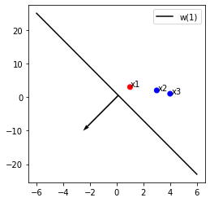
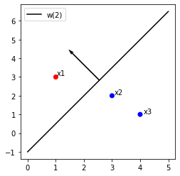
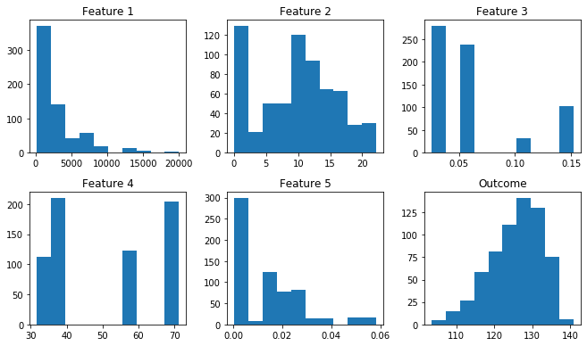

    The purpose of question 1 of this homework assignment was to run a linear perceptron algorithm on three training samples x1, x2, and x3. In this scenario, samples x1 belongs to class 1 while samples x2 and x3 belong to class 2. In part (i), I simply plotted the samples, the starting weight line and its direction. I also defined two functions, one for plotting these three things and another for computing dot product for part (ii). In part (ii), I first wrote the data points and weight as vectors and then computed the inner product between the weight and each class to see which samples were misclassified. In this case, it was sample x2, so in part (iii) I used the weight update rule to calculate a new weight based on sample x2 and graphed this new weight line and its direction. After computing the inner products again, now x1 was the only misclassified sample. I used the weight update rule one more time, this time basing it on sample x1 to get a new weight and I plotted this line. Finally after calculating these inner products, I could verify that all of the samples were correctly classified with this new weight line. 
	For question 2 of this homework, we had to implement a linear regression model using the ordinary least squares solution and then test the model by computing the residual sum of squares error between the actual and predicted outcome variable. For part (i), I simply plotted histograms of the features and outcome of the training data to observe how the values were distributed over the data. Then in part (ii) I defined a function to calculate the OLS, and then used it on the training data to compute an array of 6 weights. After this, in part (iii), I defined a function to calculate the RSS value and then used to calculate the RSS using the test data, the weights calculated previously and test data’s actual outcomes. My RSS value when using all the features was about 71. For the bonus, I followed the same process, but using different feature combinations. Using features 3 and 4 I got an RSS of about 133, using features 1, 2, and 5 I got an RSS of about 107 and when using features 1 and 4 I got an RSS of  about 85. I wasn’t able to get and RSS value smaller than when I used all the features, however, I did not test all possible combinations, so it might be possible to achieve a smaller RSS value with a different combination of features.


## Question 1 (5 points)
### Linear Perceptron Algorithm:
The goal of this problem is to run a linear perceptron algorithm. Assume that you have three training samples in the 2D space:

1. Sample $x_{1}$ with coordinates (1, 3) belonging to Class 1 ($y_{1}$ = 1)
2. Sample $x_{2}$ with coordinates (3, 2) belonging to Class 2 ($y_{2}$ = −1)
3. Sample $x_{3}$ with coordinates (4, 1) belonging to Class 2 ($y_{3}$ = −1)

The linear perceptron is initialized with a line with corresponding weight w(0) = $[2, -1, 1]^{T}$, or
else the line 2 − x + y = 0.
In contrast to the example that we have done in class, in this problem **we will include the
intercept $w_{0}$ or $x_{0}$.**

**(i) (0.5 points)** Plot $x_{1}$, $x_{2}$, and $x_{3}$ in the given 2D space. Plot the line corresponding to weight w(0), as well as the direction of the weight w(0) on the line.


```python
import numpy as np
from pandas import *
from math import *

%matplotlib inline
import matplotlib.pyplot as plt
from operator import itemgetter
```


```python
# function for plotting the sample points, weight line and the direction of the weight
def plot_graph(x, y, sample_names, colors, x0, y0, u, v, label_name):
    # plot points
    fig, ax = plt.subplots()
    ax.scatter(x, y, c=colors)
    for i, txt in enumerate(sample_names):
        ax.annotate(txt, (x[i] * (1.03), y[i]* (1.03)))
    
    # plot weight line
    plt.plot(x0, y0, '-k', label=label_name)
    plt.legend()
    
    # plot weight direction
    plt.quiver(x0[25], y0[25], u, v, scale=5)
    ax.set_aspect(1./ax.get_data_ratio())
    
```


```python
# function for computing dot product and printing results
def inner_product(line, samples, line_name):
    for i in np.arange(3):
        print("The inner product of " + line_name + " and x" + str(i+1) + ":", np.dot(line, samples[i]))
```


```python
# data for samples x1, x2, x3 
x = [1, 3, 4]
y = [3, 2, 1]

sample_names = ['x1', 'x2', 'x3']
colors = ['red' if i == 1 else 'blue' for i in x]
```


```python
# data for line corresponding to weight w(0)
x0 = np.linspace(0,5)
y0 = x0-1

# plot data points and weight line w(0) with direction
plot_graph(x, y, sample_names, colors, x0, y0, -1, 1, 'w(0)')
```


**(ii) (0.5 points)** Using the rule $sign(w(t)^{T}x_{n}$), please indicate the class in which samples $x_{1}$, $x_{2}$, and $x_{3}$ are classified using the weight w(0). Which samples are not correctly classified based on this rule?


**Note:** You have to compute the inner product $w(0)^{T}x_{n}$, n = 1, 2, 3, and see if it is greater or less than 0.


```python
# data points as vectors
x1 = np.array([1, 1, 3])
x2 = np.array([1, 3, 2])
x3 = np.array([1, 4, 1])
samples = [x1, x2, x3]

# weight line as vector
w0 = np.array([2, -1, 1])

# inner product of weight line w(0) and data samples
inner_product(w0, samples, 'w0')
```

    The inner product of w0 and x1: 4
    The inner product of w0 and x2: 1
    The inner product of w0 and x3: -1
    

*The inner product of w(0) and x1 should be greater than zero because x1 is part of class 1 and the inner products of w(0) and x2 as well as w(0) and x3 should both be negative because they're in class 2. Going off of this, x1 and x3 are correctly classified while x2 is not correctly classified.*

**(iii) (1.5 points)** Using the weight update rule from the linear perceptron algorithm, please
find the value of the new weight w(1) based on the misclassified sample from question (ii). Find
and plot the new line corresponding to weight w(1) in the 2D space, as well as the direction of
the weight w(0) on the line. Indicate which samples are correctly classified and which samples
are not correctly classified.


**Note:** The update rule is $w(t + 1) = w(t) + y_{s}x_{s}$, where $x_{s}$ and $y_{s} ∈ {−1, 1}$ is the feature
and class label of misclassified sample s.

**Hint:** The line corresponding to a vector $w = [w_{0}, w_{1}, w_{2}]$ can be written as $w_{0}+w_{1}x+w_{2}y = 0$.
Make sure that you get the direction of the vector w correctly based on the sign of $w_{1}$ and $w_{2}$.


```python
# w(1) = w(0) + ys * xs
# where:
# w(0) = [2, -1, 1]
# ys = -1
# xs = x2

# weight update rule to get w(1)
w1 = np.array(w0 - x2)
print("New weight w(1) =", w1)
```

    New weight w(1) = [ 1 -4 -1]
    


```python
# data for line corresponding to weight w(1)
x0 = np.linspace(-6,6)
y0 = 1-4*x0

# plot data points and weight line w(1) with direction
plot_graph(x, y, sample_names, colors, x0, y0, -1, -1, 'w(1)')
```





```python
# inner product of weight line w(1) and data samples
inner_product(w1, samples, 'w1')
```

    The inner product of w1 and x1: -6
    The inner product of w1 and x2: -13
    The inner product of w1 and x3: -16
    

*The inner product of w(1) and x1 should be greater than zero because x1 is part of class 1 and the inner products of w(1) and x2 as well as w(1) and x3 should both be negative because they're in class 2. Going off of this, x2 and x3 are correctly classified while x1 is not correctly classified.*

**(iv) (2.5 points)** Using the rule $sign(w(t)^{T}x_{n})$, run the linear perceptron algorithm until it converges, find and plot the weights w(2) and the corresponding lines in each iteration. For each iteration, please indicate which samples are classified correctly and which samples are not classified correctly.

**Hint:** In order to make the linear perceptron algorithm converge as fast as possible, you can
always update the weight based on sample $x_{1}$. Why?


```python
# weight update rule to get w(2)
w2 = np.array(w1 + x1)
print("New weight w(2) =", w2)
```

    New weight w(2) = [ 2 -3  2]
    


```python
# data for line corresponding to weight w(2)
x0 = np.linspace(0,5)
y0 = -1+(3/2)*x0

# plot data points and weight line w(2) with direction
plot_graph(x, y, sample_names, colors, x0, y0, -1, 1, 'w(2)')
```





```python
# inner product of weight line w(2) and data samples
inner_product(w2, samples, 'w2')
```

    The inner product of w2 and x1: 5
    The inner product of w2 and x2: -3
    The inner product of w2 and x3: -8
    

*The inner product of w(1) and x1 should be greater than zero because x1 is part of class 1 and the inner products of w(1) and x2 as well as w(1) and x3 should both be negative because they're in class 2. Going off of this, all of the samples are correctly classified.*

## Question 2 (5 points)
### Predicting sound pressure in NASA wind tunnel: 
We would like to predict the sound pressure in an anechoic wind tunnel. This can help NASA design ground-based wind tunnels in order to assess the effect of noise during spaceflight. We use data from the Airfoil Self-Noise Data Set in the following UCI Machine Learning Repository: https://archive.ics.uci.edu/ml/datasets/Airfoil+Self-Noise#.


Inside “Homework 2” folder on Piazza you can find two files including the train and test data (named “hw1 question1 train.csv” and ”hw1 question1 test.csv”) for our experiments. The rows of these files refer to the data samples, while the columns denote the features (columns 1-5) and the sound pressure output (column 6), as described bellow:

1. Frequency, in Hertz
2. Angle of attack, in degrees
3. Chord length, in meters
4. Free-stream velocity, in meters per second
5. Suction side displacement thickness, in meters
6. Scaled sound pressure level, in decibels (this is the **outcome**)

**(i) (1.5 point) Data exploration:** Using the training data, plot the histogram of each feature
and the output (i.e., 6 total histograms). How are the features and the output distributed?


```python
# read in training data
training_data = read_csv("airfoil_self_noise_train.csv")

# plot the histogram of each feature and outcome
fig, ax = plt.subplots(2,3)
fig.set_size_inches(9.25, 5.5)

ind = 0 
for i in range(2):
    for j in range(3):
        f1 = training_data.iloc[:,ind]
        ax[i][j].hist(f1)
        if (ind + 1) == 6:
            ax[i][j].set_title("Outcome")
        else:
            ax[i][j].set_title("Feature " + str(ind + 1))
        ind = ind + 1
plt.tight_layout()
```





*Feature 1 is distributed mostly around 0-5000 Hertz, feature 2 is a little more evenly distributed, with the highestest distributions around 0-1 degrees and 10 degrees. Features 3 and 4 are distributed in 4 specific values, the rest of the values having no samples and feature 5 has the most samples between 0 and 0.01 meters. The outcome distribution increases until it peaks at around 128 decibels and then it decreases.*

**(ii) (2 points)** Using the train data, implement a linear regression model using the ordinary
least squares (OLS) solution. How many parameters does this model have?


**Hint:** You will build the data matrix $X ∈ R^{N_{train}×6}$, whose rows correspond to the training
samples $x_{1}, . . . , x_{N_{train}} ∈ R^{5×1}$ and columns to the features (including the constant 1 for the
intercept): 

\begin{equation*}
\mathbf{X} =  \begin{bmatrix}
1 & x_{1}^{T} \\
: &  : \\
1 & x_{N}^{T}
\end{bmatrix}
∈ R^{N_{train}×6}
\end{equation*}


Then use the ordinary least squares solution that we learned in class: $w^{∗} = (X^{T} X)^{−1}X^{T} y$.


**Note:** You can use libraries for matrix operations.


```python
# function for ordinary least squares (OLS)
# 1) get transpose of X
# 2) calculate first half of equation: the inverse of the dot product of X transpose and X
# 3) calculate the second half of the equation: the dot product of X transpose and y

def OLS(X, y):
    transpose_X = X.transpose()
    first_half = np.linalg.inv(np.dot(transpose_X, X))
    second_half = np.dot(transpose_X, y)
    return np.dot(first_half, second_half)
```


```python
# create dataframe for outcome values 
# y
outcomes = DataFrame(training_data.iloc[:,5])
```


```python
# add column of 1's and remove the outcome column
# X
training_data.insert(0, "constant", [1] * len(training_data.iloc[:,1]), True)
training_data.drop('outcome', axis=1, inplace=True)
```


```python
# use OLS to get weights
calculated_weights = OLS(training_data, outcomes)
calculated_weights
```


    array([[ 1.32303685e+02],
           [-7.11322380e-04],
           [-4.54774159e-01],
           [-5.23017057e+01],
           [ 8.39826774e-02],
           [-9.14287813e+01]])


*The liner regression model using the ordinary least squares solution has 6 parameters in this case.*

**(iii) (1.5 points)** Test your model on the test data and compute the residual sum of squares
error (RSS) between the actual and predicted outcome variable.


```python
# function to calculate the residual sum or squares error (RSS) between the actual and predicted outcome
# 1) calculate the dot product of X and weights
# 2) calculate first half of equation: the transpose of the actual outcomes minus the dot product of X and the weights
# 3) calculate second half of equation: the actual outcomes minus the dot product of X and the weights
# 4) get the square root of the dot product of the first and second half of the equation

def RSS(X, w, y):
    x_dot_w = np.dot(X, w)
    first = (y - x_dot_w).transpose()
    second = y - x_dot_w
    return sqrt(np.dot(first, second))
```


```python
# read in testing data
test_data = read_csv("airfoil_self_noise_test.csv")

# create dataframe for outcome values 
# y
test_outcomes = DataFrame(test_data.iloc[:,5])

# add column of 1's and remove the outcome column
# X
test_data.insert(0, "constant", [1] * len(test_data.iloc[:,1]), True)
test_data.drop('outcome', axis=1, inplace=True)

# calculate RSS
rss = RSS(test_data, calculated_weights, test_outcomes)
rss
```


    71.66865682786033


**(iv) (Bonus, 2 points)** Experiment with different feature combinations and report your findings. What do you observe?


```python
# using features 3 and 4 
# remove other features from training data
training_data_f34 = training_data.drop(['f1', 'f2', 'f5'], axis=1, inplace=False)

# OLS for weights
calculated_weights_f34 = OLS(training_data_f34, outcomes)
print("weights:\n", calculated_weights_f34)

# remove other features from test data
test_data_f34 = test_data.drop(['f1','f2','f5'], axis=1, inplace=False)

# calculate RSS
rss = RSS(test_data_f34, calculated_weights_f34, test_outcomes)
print("\nRSS:", rss)
```

    weights:
     [[ 1.25761164e+02]
     [-5.44150127e+01]
     [ 6.06585582e-02]]
    
    RSS: 133.45352324493342
    


```python
# using features 1, 2 and 5
# remove other features from training data
training_data_f125 = training_data.drop(['f3', 'f4'], axis=1, inplace=False)

# OLS for weights
calculated_weights_f125 = OLS(training_data_f125, outcomes)
print("weights:\n", calculated_weights_f125)

# remove other features from test data
test_data_f125 = test_data.drop(['f3','f4'], axis=1, inplace=False)

# calculate RSS
rss = RSS(test_data_f125, calculated_weights_f125, test_outcomes)
print("\nRSS:", rss)
```

    weights:
     [[ 1.32516436e+02]
     [-5.76514811e-04]
     [-1.46030326e-01]
     [-2.60904487e+02]]
    
    RSS: 107.44085921265567
    


```python
# using features 1 and 4
# remove other features from training data
training_data_f14 = training_data.drop(['f2', 'f3', 'f5'], axis=1, inplace=False)

# OLS for weights
calculated_weights_f14 = OLS(training_data_f14, outcomes)
print("weights:\n", calculated_weights_f14)

# remove other features from test data
test_data_f14 = test_data.drop(['f2', 'f3', 'f5'], axis=1, inplace=False)

# calculate RSS
rss = RSS(test_data_f14, calculated_weights_f14, test_outcomes)
print("\nRSS:", rss)
```

    weights:
     [[ 1.23150041e+02]
     [-1.39844979e-04]
     [ 5.75414946e-02]]
    
    RSS: 85.24503305195404
    

*After experimenting with different combinations, I was unable to get a combination that produced a lower RSS value than I got when using all of the features. Of course, I did not try all the possible feature combinations, so there is the possibility that a combination I didn't try could give a smaller RSS value.*


```python

```
